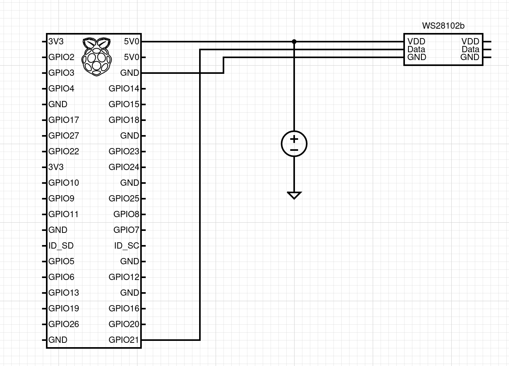
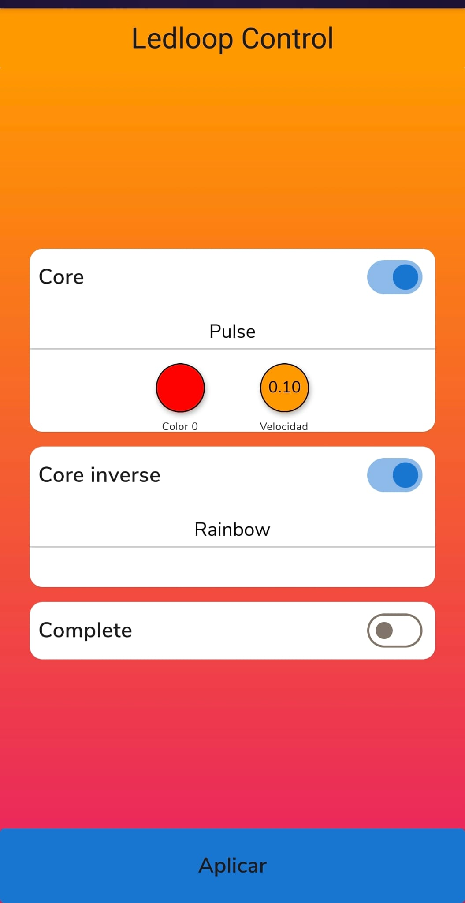

# The ledloop project

This a DIY alternative Nanoleaf led lights project. Following these instructions, you will be able to build your own fully customizable LED lights system, which is powered by a Raspberry Pi.
It will be controlled with an embedded web app hosted in the Raspberry Pi itself.

The LED strips configuration is fully customizable to your needs as well as the operating system configuration. For example, it is quite easy to customize your Wi-Fi settings or the hostname.

## Building software

This repo is powered by the yocto project and docker.

```bash
git clone https://github.com/Gmatarrubia/ledloop-yocto.git

#(optional) For your saffety
git update-index --assume-unchange meta-ledloop/recipes-connectivity/wpa-supplicant/files/*

cd ledloop-yocto
./init-docker-env.sh
./build.sh -m rpizw -wi
# use ./build.sh --help for more information
# wait a long time for getting the image generated
```

- Plug a uSD in your PC for writting the generated image you can use bmap tool to write it.

- Disconnect the uSD from the PC, insert it in the raspberry Pi and power on the Raspi.

### Software Architecture

The project OS image starts a few services at the beginning:

- Wi-Fi service to connect the Raspberry Pi to your network.
- Ledloop service. It is a Python application that reads a json configuration and runs it in the LEDs.
- Fcgiwrap service. A fast CGI service that services the Python scripts as a backend and as an intermediate between the Flutter App and the Python LEDs services.
- Nginx service. It hosts the EWS (application written in Flutter).

## Hardware and schematics

I use a Raspberry Pi Zero W Rev1.3. But any of then can be used. Just make sure you read the [rpi_ws281x library](https://github.com/jgarff/rpi_ws281x) documentation for knowing which GPIOs can be use for the connection.

As a summary you can use any GPIOs with access to some of this devices:

- PCM (GPIO 21 corresponding to physical pin #40 on a Raspi zero w)
- PWM0 (GPIO 18 corresponding to physical pin #12 on a Raspi zero w)
- PWM1
- SPI (GPIO 12 corresponding to physical pin # on a Raspi zerow)

Connect Raspi's 5V pin with positive of a 5V power source and the Vdd pin of the ws2812b strip.
Connect your choosen GPIO with the Data pin in the strip.
Finally, connect de all the grounds.

<div align="center">
  
</div>

## Playing time

Coming soon.

### Configuration

Coming soon.

### How to use the product

1. Power on the Rasberry Pi.
2. Wait until the script makes some flashings.
3. Connect your device (phone/tablet/laptop) to the same Wi-Fi than you previously configured the Raspi.
4. Open the browser and go to the EWS. By default the host name will be *ledloop.local* so you can try:
[http://ledloop.local](http://ledloop.local)

If everything was successful you might see a similiar screen to the following one.

<div align="center">
  
</div>
